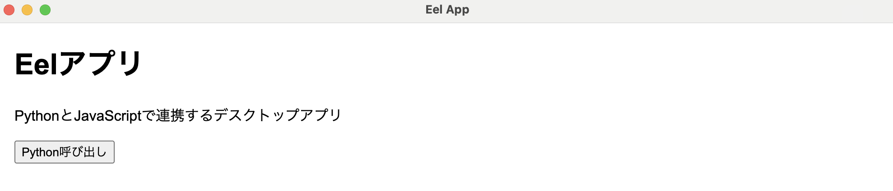

# PyEel-Desktop-App


このプロジェクトは、PythonのバックエンドとHTML/CSS/JavaScriptを組み合わせたモダンなEelベースのデスクトップアプリケーションです。

## セットアップ手順

### Minicondaを使用する場合の仮想環境でのセットアップ

#### 必要なツール
- [Miniconda](https://docs.conda.io/en/latest/miniconda.html) がインストールされている必要があります。

#### 手順

1. **プロジェクトをクローンする**

    ```bash
    git clone https://github.com/your-username/PyEel-Desktop-App.git
    cd PyEel-Desktop-App
    ```

2. **Conda環境を作成**

    `env.yml`ファイルを使用して、新しい仮想環境を作成します。

    ```bash
    conda env create -f env.yml
    ```

3. **環境をアクティベート**

    作成した仮想環境をアクティベートします。

    ```bash
    conda activate eel_env
    ```

4. **アプリケーションの実行**

    環境が整ったら、以下のコマンドでアプリケーションを起動します。

    ```bash
    python run.py
    ```

### 既にPythonがインストールされている場合（`requirements.txt`を使用）

#### 必要なツール
- Python 3.8 以上がインストールされている必要があります。

#### 手順
2, 3の仮想環境の構築は任意です。

1. **プロジェクトをクローンする**

    ```bash
    git clone https://github.com/your-username/PyEel-Desktop-App.git
    cd PyEel-Desktop-App
    ```

2. **仮想環境の作成（オプション）**

    仮想環境を手動で作成することをお勧めします。`venv`モジュールを使って仮想環境を作成します。

    ```bash
    python -m venv eel_env
    ```

3. **仮想環境のアクティベート**

    - **Windows**:
      ```bash
      eel_env\Scripts\activate
      ```
    - **macOS/Linux**:
      ```bash
      source eel_env/bin/activate
      ```

4. **依存関係のインストール**

    `requirements.txt`ファイルを使用して、必要なパッケージをインストールします。

    ```bash
    pip install -r requirements.txt
    ```

5. **アプリケーションの実行**

    仮想環境がアクティブな状態で、以下のコマンドを使ってアプリケーションを起動します。

    ```bash
    python run.py
    ```

---

## 動作確認

アプリケーションが正常に起動すると、Eelベースのウィンドウが立ち上がり、簡単なUIが表示されます。ボタンをクリックすると、Pythonからのメッセージが表示されます。（2024年10月19日時点では何も返って来ません。）

---

## トラブルシューティング

1. **モジュールが見つからない**エラーが発生した場合は、依存関係が正しくインストールされていない可能性があります。以下を確認してください。

    ```bash
    pip install -r requirements.txt  # Pythonが既にある場合
    ```

    または

    ```bash
    conda env create -f env.yml  # Miniconda環境を使う場合
    ```

2. **仮想環境がアクティブでない**場合は、仮想環境を再度アクティベートしてください。

以下に、`README.md`の「# dbの扱い」章として、初期データの更新方法、データのGUIでの閲覧方法、Eelからデータベースへのアクセス方法をまとめた内容を示します。

---

## dbの扱い

### 初期データの更新

MongoDBコンテナの初期データは、`db/init_data.json`に記載されています。初期データを変更した場合、以下の手順で新しいデータを反映させることができます。

1. `init_data.json`ファイルの内容を編集して、データを更新します。

2. **MongoDBコンテナの起動**
   ```bash
   docker-compose up -d
   ```

3. **初期データのインポート**

   初期データを `init_data.json` から MongoDB にインポートするには、以下のコマンドを実行します。

   ```bash
   docker exec -i mongo_container mongoimport --db bus_schedule_db --collection service_types --drop --jsonArray --file /docker-entrypoint-initdb.d/init_data.json
   ```

   - `--db`: インポート先のデータベース名（ここでは `bus_schedule_db`）
   - `--collection`: インポート先のコレクション名（例: `service_types`）
   - `--drop`: インポート前に既存のコレクションを削除
   - `--jsonArray`: JSONファイルが配列形式であることを指定
   - `--file`: インポートするファイルのパス

4. **データの更新方法**

   - データを更新する場合、MongoDB内の既存のデータを削除してから再度インポートします。
   - 例えば、以下のコマンドで既存のデータを削除した後、上記の`mongoimport`コマンドで再インポートします。

   ```bash
   docker exec -it mongo_container mongosh --eval "use bus_schedule_db; db.service_types.drop()"
   ```

5. **データの確認**

   データが正しくインポートされたかは、`mongo-express`（`http://localhost:8081`）またはMongoシェルを使用して確認できます。

---

### データをGUIチックに見るための方法

MongoDBのデータをブラウザで視覚的に確認するために、`mongo-express`が設定されています。以下の手順でGUIからデータを閲覧・編集できます。

1. `docker-compose up -d`コマンドでMongoDBと`mongo-express`の両方のコンテナを起動します。
2. ブラウザで`http://localhost:8081`にアクセスします。
3. `mongo-express`のWebインターフェースからMongoDBのデータを視覚的に確認・編集できます。

### Eel側からデータを閲覧する方法

JavaScriptからPythonを経由してMongoDBのデータを取得するには、Eelを使ってデータを取得する関数を呼び出します。

以下は、サンプルとして、JavaScriptから日付と停留所名を指定してMongoDBからバスの時刻表を取得するコードです。

#### Pythonコード（`run.py`）

MongoDBからデータを取得するためのPython関数を定義し、Eelで公開します。

```python
import eel
import pymongo
import os
import random

# MongoDBに接続
mongo_uri = os.getenv("MONGO_URI", "mongodb://localhost:27017/")
client = pymongo.MongoClient(mongo_uri)
db = client["bus_schedule_db"]

# Eelの初期化
eel.init("web")

# サービスタイプをランダムに返す関数
@eel.expose
def get_random_service_type():
    service_types = ["2-bus-day", "3-bus-day-full", "holiday"]
    return random.choice(service_types)

# 日付に応じたバス時刻表を取得
@eel.expose
def get_timetable(date_str, stop):
    service_type_key = get_random_service_type()  # ランダムでサービスタイプを取得
    service_types = db["service_types"].find_one({"_id": "service_types"})
    service_type_schedule = service_types["service_types"].get(service_type_key, [])
    
    for entry in service_type_schedule:
        if entry["stop"] == stop:
            return entry["departure_times"]
    return "該当するデータがありません"

# アプリケーションの起動
eel.start("index.html")

```

#### JavaScriptコード（`web/script.js`）

JavaScriptからPythonの`get_timetable`関数を呼び出して、時刻表データを取得するコードです。

```javascript
function showTimetable(date, stop) {
    // Pythonのget_timetable関数を呼び出し
    eel.get_timetable(date, stop)((response) => {
        console.log(response);  // コンソールに時刻表データを表示
        document.getElementById("timetable").innerText = response;
    });
}

```

#### HTMLファイル（`web/index.html`）

簡単なUIを構築し、指定した日付と停留所名でバスの時刻表を取得します。

```html
<!DOCTYPE html>
<html lang="en">
<head>
    <meta charset="UTF-8">
    <meta name="viewport" content="width=device-width, initial-scale=1.0">
    <title>バス時刻表</title>
    <script type="text/javascript" src="/eel.js"></script>
    <script src="script.js"></script>
</head>
<body>
    <h1>バス時刻表</h1>
    <input type="date" id="date" />
    <input type="text" id="stop" placeholder="停留所名を入力" />
    <button onclick="showTimetable(document.getElementById('date').value, document.getElementById('stop').value)">時刻表を取得</button>
    <pre id="timetable"></pre>
</body>
</html>

```
